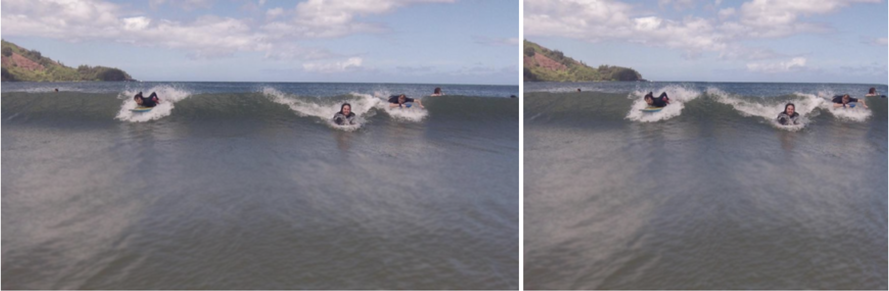

<h2>Seam Carver</h2>

<strong style="">content aware image transformations</strong>

<h2>Background</h2>

Traditional image transformations including cropping and 
squishing / squeezing the image introduces undesirable distortion.
<strong>Seam Carving</strong> is a technique which removes a seam of the least 
noticeable pixels by using a power function of each pixel (its RGB gradient in 
relation to adjacent pixels) to represents weights of an acyclic digraph.

We find each seam by calculating the minimum path length by considering the graph as a digraph with each pixel with paths to the 
pixels immediately below it, either straight down, to the left or to the right (for vertical seams).
 Here is a <a href="https://www.youtube.com/watch?v=6NcIJXTlugc">demo</a>.

This project is based on <a href="https://coursera.cs.princeton.edu/algs4/assignments/seam/specification.php">this</a> assignment, 
adapted for functional programming, as opposed to using plain old Java ⠀⠀⠀⠀⠀⠀⠀⣠⣾⣿⠿⠛⠛⠋⠉⠉⠛⠛⠛⠻⢽⣦⣄⡀⠀⠀⠀⠀⠀⠀
⠀⠀⠀⠀⢀⣴⡾⠛⠉⠀⠀⠀⠀⠀⠀⠀⠀⠀⠀⠀⠀⠈⠑⠻⣖⣄⠀⠀⠀⠀
⠀⠀⢀⣼⡿⠁⠀⠀⠀⠀⠀⠀⠀⠀⣀⣀⣀⡀⠀⠀⠀⠀⠀⠀⠈⠻⣷⡄⠀⠀
⠀⢠⣾⠋⠀⠀⠀⠀⠀⠀⢀⣠⣴⣾⣁⠀⠉⠉⠑⠲⣄⡀⠀⠀⠀⠀⠈⢾⣆⠀
⣰⣿⠃⠀⠀⠀⣰⣶⣶⣶⣿⣁⣀⠀⠉⠉⠓⠦⣄⡀⠀⠙⢶⡒⠲⢦⡀⠈⢯⣦
⣿⡇⠀⠀⢀⣴⠃⠀⠀⢹⣏⠉⠉⠉⠙⠲⢤⡀⠈⠱⠆⠀⠀⠙⠂⠀⢳⡀⠘⡿
⣻⠀⠀⣠⡿⠁⡀⠀⠄⣸⢿⡟⠲⠦⣄⡀⠀⠙⠂⠀⠀⠀⠀⠀⠀⠀⠀⢷⠀⢷
⣿⠀⣴⡟⡠⢡⢐⢉⣼⣇⡈⠳⣤⣀⠀⠙⠀⠀⠀⠀⠀⠀⠀⠀⠀⠀⠀⠘⡄⢺
⣿⣼⠏⡴⡑⢆⣪⣾⣁⠉⠙⠛⠶⢯⣿⣦⡀⠀⠀⠀⠀⠀⠀⠀⠀⠀⠀⠀⡥⣻
⣿⣏⡜⣲⡙⣶⠟⣿⣿⣿⣶⣦⣤⣀⡈⠉⠻⣤⡀⠀⠀⠀⠀⠀⠀⠀⠀⠀⢰⠻
⠹⣿⡜⢦⣽⠏⠀⠘⢿⣿⣿⣿⣿⣿⣿⣷⣶⣤⣙⣲⣤⡄⠀⠀⠀⠀⠀⠀⢘⠀
⠀⠘⢿⣿⠃⠐⠠⠀⠀⠙⠻⣿⣿⣿⣿⣿⣿⣿⣿⣿⡿⣿⠀⠀⠀⠀⠀⠀⢨⠀
⠀⠀⠈⠻⣿⣤⠁⠂⠄⡀⠀⠀⠈⠉⠙⠛⠋⠉⠉⢸⣯⢽⣇⠀⠀⠀⠀⠀⡂⢸
⠀⠀⠀⠀⠈⠻⢿⣦⣔⡠⠁⠂⢄⠠⠀⠄⠠⠐⡀⢸⣯⢎⣿⣆⣀⡀⣀⣴⡱⠀
⠀⠀⠀⠀⠀⠀⠀⠘⠛⡽⣷⣾⣦⣤⣥⣬⡤⣵⣶⣾⡿⣟⠊⡙⣒⠛⠓⠉⠀⠀

